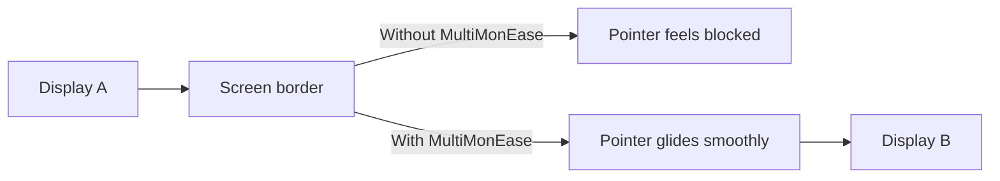

# MultiMonEase

MultiMonEase is a macOS menu bar app that makes your mouse pointer move smoothly between monitors, especially when displays have different sizes or scaling.

## What it does

- Reduces sudden cursor jumps at monitor borders.
- Makes crossing from one screen to another feel more natural.
- Lets you quickly enable/disable smoothing from the menu bar.
- Lets you tune behavior in Preferences (global toggle, crossing speed, per-edge control).

## Drawings

### Cursor behavior at the screen border

## Download

Get the latest version from the GitHub releases page:

**[Download the latest release](https://github.com/meziantou/Meziantou.MultiMonEase/releases/latest)**

On the release page, download the app package from **Assets**, then open it on your Mac.

## How to use

1. Download the app from the [latest release](https://github.com/meziantou/Meziantou.MultiMonEase/releases/latest).
2. The app appears in your macOS menu bar.
3. On first run, grant Accessibility permission when prompted.
4. Move the pointer between monitors to feel smoother transitions.
5. Open **Preferences** from the menu bar icon to adjust behavior.

## Tips

- If crossing feels too slow, lower the crossing duration.
- If one border feels odd, disable easing only for that specific edge.
- Turn on **Launch at login** in the menu to keep it always available.
